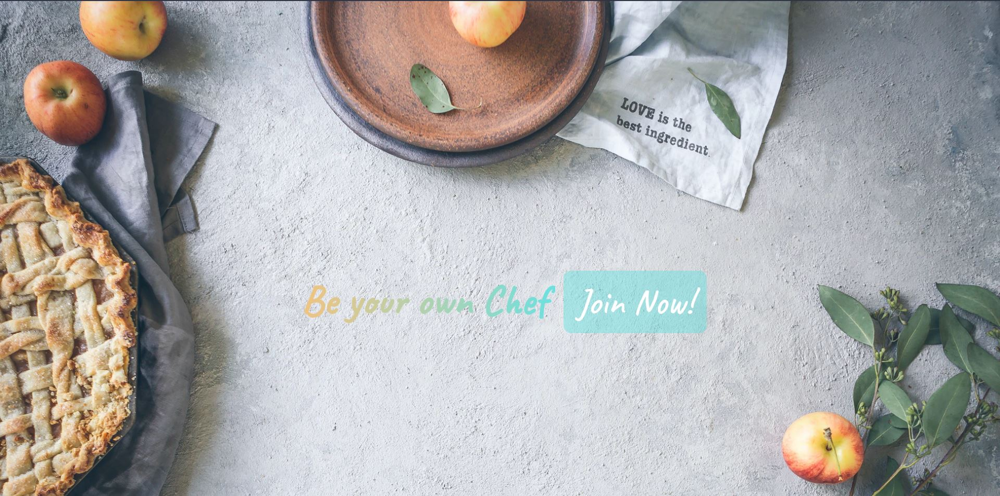
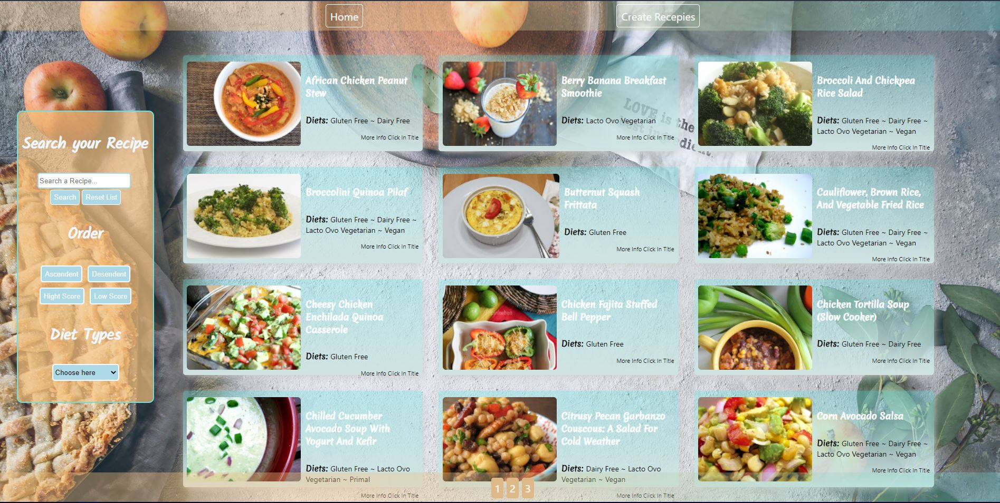
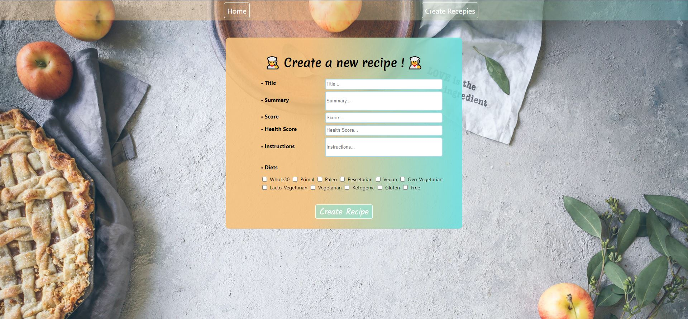

<h1>Be your Own Chef</h1>

Desarrollo de una SPA (Single Page Application )
Usando tecnologías tales como:

- FrontEnd -> React, Redux , CCS, Html
- BackEnd -> Node.js , Express, Manejo de Api
- DataBase -> Sequelize - Postgres 
  En donde todos los componentes están creados sin el uso de librerías externas y la misma tiene las funcionalidades de Cache de búsqueda, ordenamiento, filtrado y contiene un formulario controlado para la creación de nuevas recetas

Development of a SPA (Single Page Application)
Using technologies such as:

- FrontEnd -> React, Redux, CCS, Html
- BackEnd -> Node.js, Express, Api Management
- DataBase -> Sequelize - Postgres 
Where all the components are created without the use of external libraries and it has the functionalities of Cache search, ordering, filtering and contains a controlled form for the creation of new recipes.

